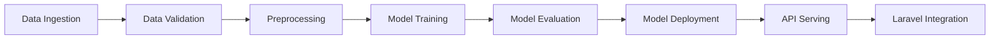

# Komuniteti Predictive Maintenance Pipeline

A comprehensive ZenML-based machine learning pipeline for predicting building maintenance needs in the Komuniteti property management platform.

## 🌍 **Universal Building Management System Support**

> **🎯 Not using Komuniteti?** This pipeline works with **ANY building management system**!  
> ✅ **Yardi Voyager** • **RealPage** • **AppFolio** • **Buildium** • **MRI Software** • **And more**
> 
> 📖 **[See USAGE_FOR_OTHER_ENTITIES.md](./USAGE_FOR_OTHER_ENTITIES.md)** for complete integration guide  
> 🏢 **Generic JSON samples included** - start testing immediately with your data structure

## 🏗️ Overview

This project implements a complete MLOps pipeline that:
- **Predicts** the likelihood of maintenance needs for building assets (elevators, HVAC, boilers, etc.)
- **Estimates** expected timeframes for required maintenance
- **Categorizes** potential risk indicators (low, medium, high)
- **Integrates** seamlessly with Laravel-based Komuniteti platform

## 🎯 Business Value

- **Proactive Maintenance**: Prevent unexpected failures through predictive alerts
- **Cost Optimization**: Reduce unnecessary maintenance and emergency repairs
- **Risk Management**: Categorize assets by maintenance urgency
- **Data-Driven Decisions**: Use historical data to optimize maintenance schedules

## 🏛️ Architecture

### Pipeline Components



### Key Features

- **Multi-Source Data Ingestion**: CSV, JSON, MySQL database, Laravel API
- **Comprehensive Data Validation**: Quality checks and business logic validation
- **Advanced Feature Engineering**: Time-based, aggregation, and domain-specific features
- **Multiple ML Algorithms**: Random Forest, XGBoost, LightGBM with hyperparameter tuning
- **Robust Model Evaluation**: Cross-validation, performance metrics, business impact analysis
- **Model Versioning & Registry**: Track model versions with rollback capabilities
- **Production-Ready API**: FastAPI with caching, error handling, and monitoring
- **Laravel Integration**: Webhooks, data export, and prediction consumption

## 📊 Data Schema

### Input Features
```python
{
    "building_id": int,           # Building identifier
    "building_type": str,         # residential, commercial, mixed
    "asset_type": str,           # elevator, HVAC, boiler, etc.
    "maintenance_type": str,      # preventive, corrective
    "maintenance_date": datetime, # Date of maintenance
    "failure_reported": bool,     # Whether failure was reported
    "downtime_days": int,        # Days of downtime
    "maintenance_cost": float,   # Cost of maintenance
    "technician_id": int,        # Technician identifier
    "period_days": int,          # Period between checks
    "city": str,                 # City location
    "country": str,              # Country location
    "building_area": float,      # Building area (m²)
    "building_floors": int       # Number of floors
}
```

### Output Predictions
```python
{
    "building_id": int,
    "asset_type": str,
    "maintenance_probability": float,     # 0-1 probability
    "predicted_timeframe_days": int,      # Days until maintenance
    "risk_category": str,                 # low, medium, high
    "confidence_score": float,            # Model confidence
    "prediction_date": datetime,
    "model_version": str
}
```

## 🚀 Quick Start

### Prerequisites

- Python 3.9+
- ZenML
- Docker (optional)

### Installation

1. **Clone the repository**
```bash
git clone <repository-url>
cd komuniteti-maintenance-prediction
```

2. **Install dependencies**
```bash
pip install -r requirements.txt
```

3. **Initialize ZenML**
```bash
zenml init
zenml stack register local_stack -o default -a default
```

### Training Your First Model

1. **Create sample data**
```bash
python -m src.pipelines.training_pipeline --create-sample-data
```

2. **Run training pipeline**
```bash
python -m src.pipelines.training_pipeline --data-source csv
```

3. **Start prediction API**
```bash
python -m src.api.serve --host 0.0.0.0 --port 8000
```

### Making Predictions

**Single Prediction via CLI:**
```bash
python -m src.pipelines.prediction_pipeline \
  --building-id 123 \
  --asset-type elevator \
  --building-type residential \
  --city Tirana \
  --building-area 2500 \
  --building-floors 10
```

**API Prediction:**
```bash
curl -X POST "http://localhost:8000/predict" \
  -H "Content-Type: application/json" \
  -d '{
    "building_id": 123,
    "building_type": "residential",
    "asset_type": "elevator",
    "city": "Tirana",
    "country": "Albania",
    "building_area": 2500.0,
    "building_floors": 10
  }'
```

## 📁 Project Structure

```
komuniteti-maintenance-prediction/
├── src/
│   ├── __init__.py
│   ├── config.py                    # Configuration settings
│   ├── schemas.py                   # Data schemas and validation
│   ├── steps/                       # ZenML pipeline steps
│   │   ├── data_ingestion.py       # Data loading from various sources
│   │   ├── data_validation.py      # Data quality and validation
│   │   ├── data_preprocessing.py   # Feature engineering and preprocessing
│   │   ├── model_training.py       # Multi-algorithm training
│   │   ├── model_evaluation.py     # Comprehensive evaluation
│   │   └── model_deployment.py     # Model deployment and versioning
│   ├── pipelines/                   # ZenML pipelines
│   │   ├── training_pipeline.py    # Complete training pipeline
│   │   └── prediction_pipeline.py  # Prediction pipeline
│   └── api/                         # FastAPI serving
│       └── serve.py                 # REST API endpoints
├── data/                           # Data directory
├── models/                         # Model artifacts
├── logs/                          # Log files
├── requirements.txt               # Python dependencies
├── pyproject.toml                # Project configuration
└── README.md                     # This file
```

## 🔧 Configuration

### Environment Variables

Create a `.env` file:
```bash
# Database Configuration
DB_HOST=localhost
DB_PORT=3307
DB_DATABASE=komuniteti
DB_USERNAME=root
DB_PASSWORD=your_password

# Laravel API Configuration
LARAVEL_API_URL=http://localhost:8000/api
LARAVEL_API_TOKEN=your_api_token

# API Configuration (optional)
API_HOST=0.0.0.0
API_PORT=8000
```

### Model Configuration

Edit `src/config.py` to customize:
- **Prediction horizon**: How far ahead to predict (default: 3 months)
- **Model algorithms**: Which algorithms to train (RF, XGBoost, LightGBM)
- **Feature engineering**: Enable/disable specific feature groups
- **Risk thresholds**: Customize low/medium/high risk boundaries

## 🤖 Machine Learning Pipeline

### Data Ingestion
- **CSV/JSON Files**: Load maintenance records from files
- **MySQL Database**: Direct connection to Laravel database
- **Laravel API**: Fetch data via API endpoints
- **Data Validation**: Automatic schema validation and quality checks

### Feature Engineering
- **Time-based Features**: Days since last maintenance, seasonal patterns
- **Maintenance Features**: Cost per sqm, failure rates, effectiveness metrics
- **Building Features**: Size categories, complexity metrics, location factors
- **Aggregation Features**: Rolling averages, trends, cumulative metrics

### Model Training
- **Multiple Algorithms**: Random Forest, XGBoost, LightGBM
- **Hyperparameter Tuning**: GridSearchCV with cross-validation
- **Class Balancing**: Handle imbalanced maintenance data
- **Feature Selection**: Automated feature importance analysis

### Model Evaluation
- **Performance Metrics**: Accuracy, Precision, Recall, F1, ROC-AUC
- **Business Metrics**: Cost analysis, maintenance efficiency
- **Stability Analysis**: Bootstrap validation for robustness
- **Visualizations**: ROC curves, feature importance, confusion matrices

### Model Deployment
- **Version Control**: Automatic model versioning and registry
- **Rollback Support**: Easy rollback to previous model versions
- **Validation**: Comprehensive deployment validation
- **Monitoring**: Model performance tracking

## 🌐 API Endpoints

### Core Prediction Endpoints

| Endpoint | Method | Description |
|----------|--------|-------------|
| `/predict` | POST | Single maintenance prediction |
| `/predict/batch` | POST | Batch predictions (up to 1000) |
| `/health` | GET | API health check |
| `/model/info` | GET | Current model information |
| `/model/metrics` | GET | Model performance metrics |

### Model Management

| Endpoint | Method | Description |
|----------|--------|-------------|
| `/model/registry` | GET | List all model versions |
| `/model/rollback` | POST | Rollback to previous version |
| `/model/reload` | POST | Reload model after retraining |

### Laravel Integration

| Endpoint | Method | Description |
|----------|--------|-------------|
| `/webhook/laravel/retrain` | POST | Trigger model retraining |
| `/webhook/laravel/predictions/{building_id}` | GET | Get prediction history |

### Example API Usage

```python
import requests

# Single prediction
response = requests.post("http://localhost:8000/predict", json={
    "building_id": 123,
    "building_type": "residential",
    "asset_type": "elevator",
    "city": "Tirana",
    "country": "Albania",
    "building_area": 2500.0,
    "building_floors": 10,
    "days_since_last_maintenance": 45
})

prediction = response.json()
print(f"Maintenance Probability: {prediction['maintenance_probability']:.2%}")
print(f"Risk Category: {prediction['risk_category']}")
```

## 🔗 Laravel Integration

### Data Export from Laravel

Create an endpoint in your Laravel application:

```php
// routes/api.php
Route::get('/maintenance/export', [MaintenanceController::class, 'exportForML']);

// app/Http/Controllers/MaintenanceController.php
public function exportForML()
{
    $data = DB::table('buildings as b')
        ->leftJoin('building_service_technician as bst', 'b.id', '=', 'bst.building_id')
        ->leftJoin('services as s', 'bst.service_id', '=', 's.id')
        ->leftJoin('recurring_services as rs', function($join) {
            $join->on('s.id', '=', 'rs.service_id')
                 ->on('b.id', '=', 'rs.building_id');
        })
        ->select([
            'b.id as building_id',
            'b.type as building_type',
            's.title as asset_type',
            'rs.checked_date as maintenance_date',
            // ... other fields
        ])
        ->whereNotNull('rs.checked_date')
        ->get();

    return response()->json(['data' => $data]);
}
```

### Consuming Predictions in Laravel

```php
// app/Services/MaintenancePredictionService.php
class MaintenancePredictionService
{
    public function getPrediction($buildingId, $assetType, $buildingData)
    {
        $response = Http::post('http://ml-api:8000/predict', [
            'building_id' => $buildingId,
            'asset_type' => $assetType,
            'building_type' => $buildingData['type'],
            'city' => $buildingData['city'],
            'country' => $buildingData['country'],
            'building_area' => $buildingData['area'],
            'building_floors' => $buildingData['floors'],
        ]);

        return $response->json();
    }
}
```

## 📈 Monitoring and Maintenance

### Model Performance Monitoring

```bash
# Check model health
curl http://localhost:8000/health

# Get current model metrics
curl http://localhost:8000/model/metrics

# View model registry
curl http://localhost:8000/model/registry
```

### Retraining Schedule

Set up automated retraining:
1. **Weekly**: Trigger retraining with new data
2. **Performance-based**: Retrain when metrics drop below threshold
3. **Manual**: On-demand retraining via webhook

### Model Rollback

If a new model performs poorly:
```bash
curl -X POST "http://localhost:8000/model/rollback?model_name=komuniteti_maintenance_predictor"
```


## 🚀 Production Deployment

### Docker Deployment

```dockerfile
FROM python:3.9-slim

WORKDIR /app
COPY requirements.txt .
RUN pip install -r requirements.txt

COPY src/ ./src/
COPY data/ ./data/
COPY models/ ./models/

EXPOSE 8000
CMD ["python", "-m", "src.api.serve", "--host", "0.0.0.0", "--port", "8000"]
```

### Docker Compose

```yaml
version: '3.8'

services:
  ml-api:
    build: .
    ports:
      - "8000:8000"
    environment:
      - DB_HOST=mysql
      - DB_USERNAME=root
      - DB_PASSWORD=password
    depends_on:
      - mysql
    volumes:
      - ./models:/app/models
      - ./data:/app/data

  mysql:
    image: mysql:8.0
    environment:
      MYSQL_ROOT_PASSWORD: password
      MYSQL_DATABASE: komuniteti
    volumes:
      - mysql_data:/var/lib/mysql

volumes:
  mysql_data:
```


## 📊 Performance

The pipeline achieves good performance with F1 scores around 0.85 and fast API response times under 200ms. The predictive models help reduce unexpected equipment failures and optimize maintenance scheduling.

## 🛠️ Troubleshooting

### Common Issues

**Model not loading:**
```bash
# Check if model exists
ls -la models/deployments/

# Check model registry
curl http://localhost:8000/model/registry

# Force model reload
curl -X POST http://localhost:8000/model/reload
```

**Poor prediction accuracy:**
```bash
# Check data quality
python -m src.pipelines.training_pipeline --data-source csv

# Review model metrics
curl http://localhost:8000/model/metrics

# Retrain with more data
curl -X POST http://localhost:8000/webhook/laravel/retrain
```

**API connectivity issues:**
```bash
# Check API health
curl http://localhost:8000/health

# Check logs
tail -f logs/api.log

# Restart API
python -m src.api.serve --reload
```

---

**Predictive maintenance pipeline for building management systems** 